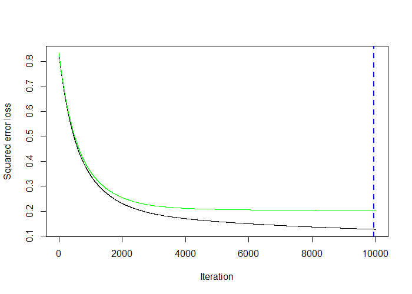
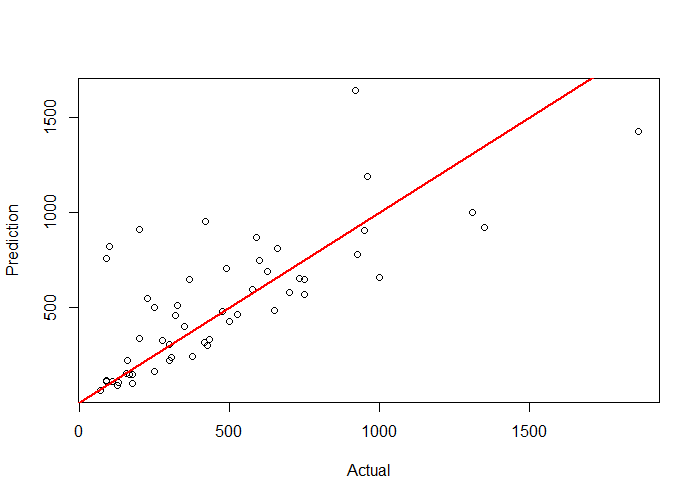

# R_CS_06
Sports Analytics in R (Gradient Boost approaches for Decision Tree in Regression problems)

### Case-Study Title: Sports Analytics (Gradient Boost approaches for Decision Tree in Regression problems)
### Data Analysis methodology: CRISP-DM
### Dataset: Hitters dataset (Major League Baseball Data from the 1986 and 1987 seasons in US)
### Case Goal: Annual Salary prediction of each Player in 1987 base on his performance in 1986

Loss Function as a result of n Trees added to the Ensemble in GBoost

Actuals versus Predictions plot

